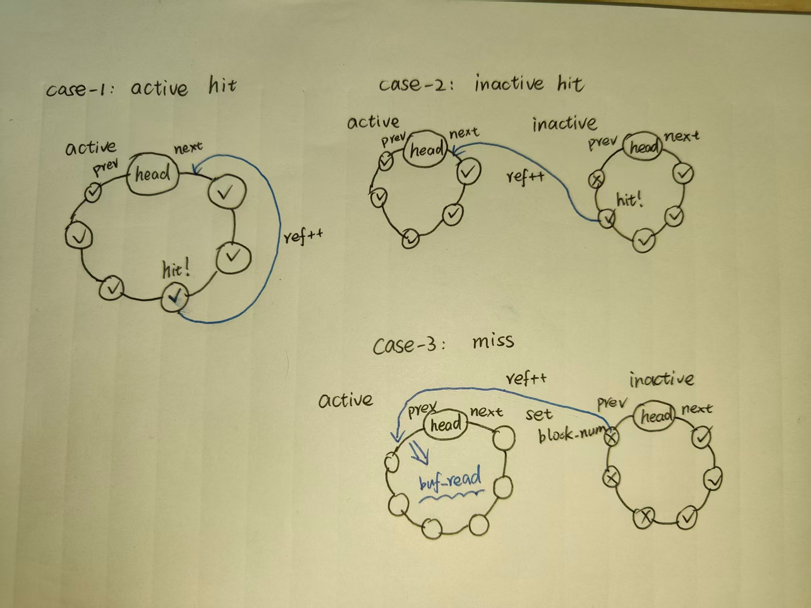
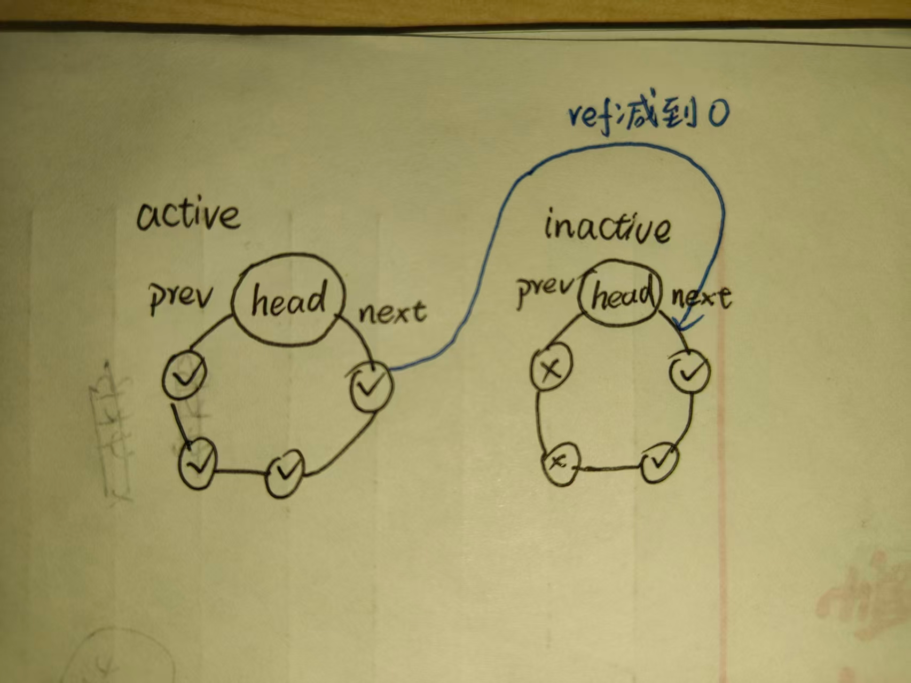

# LAB-7: 文件系统 之 磁盘管理

**前言**

本次实验我们将围绕磁盘管理构建文件系统的基础设施

1. 首先讨论QEMU启动时的输入参数disk.img是如何构建的

2. 随后讨论以block为基本单位的磁盘读写如何实现, 包括驱动本身+OS提供的配合

3. 随后讨论磁盘与内存进行数据交换的桥梁--缓冲系统(buffer)

4. 最后讨论磁盘上bitmap区域的管理方法

## 代码组织结构

```text
OSExp_ECNU
├── Makefile       CHANGE: 构建 disk.img 并挂载 VirtIO 块设备
├── README.md      本实验报告与任务说明
├── picture         LAB-7 原理图与参考输出图
└── src
    ├── kernel
    │   ├── fs
    │   │   ├── bitmap.c   TODO: bitmap 申请、释放与显示
    │   │   ├── buf.c      TODO: buffer cache、LRU、读写与释放
    │   │   ├── fs.c       TODO: buffer 初始化并读取 superblock
    │   │   ├── virtio.c   NEW: VirtIO 块设备驱动
    │   │   ├── method.h   NEW: 文件系统接口
    │   │   ├── mod.h      NEW: 文件系统聚合头
    │   │   └── type.h     NEW: 磁盘、buffer、superblock 类型
    │   ├── mem
    │   │   └── kvm.c      TODO: VirtIO MMIO 映射与 NULL 页表处理
    │   ├── proc
    │   │   └── proc.c     TODO: proc_return 中调用 fs_init
    │   ├── syscall
    │   │   ├── syscall.c  TODO: 11-21 号系统调用分派
    │   │   └── sysfunc.c  TODO: bitmap 与 buffer 系统调用
    │   ├── trap
    │   │   ├── plic.c         TODO: 使能 VirtIO 中断
    │   │   └── trap_kernel.c  TODO: 响应 VirtIO 外设中断
    │   └── main.c         CHANGE: CPU-0 调用 virtio_disk_init
    ├── mkfs
    │   ├── mkfs.c         NEW: Linux 主机侧磁盘格式化工具
    │   └── mkfs.h         NEW: disk.img 磁盘布局
    └── user
        ├── initcode.c     CHANGE: LAB-7 测试用例
        └── syscall_num.h  CHANGE: 11-21 号用户系统调用
```

**标记说明**

- **NEW**：直接引入的新增文件。
- **CHANGE**：实验提供的接口、构建或测试更新，已迁移。
- **TODO**：本实验需要完成的功能；迁移阶段仅保留骨架，不应以模板覆盖前序实验的实现。

## 实验目标

1. 使用 `mkfs` 生成磁盘映像 `target/mkfs/disk.img`，其布局为：

```text
[ superblock | inode bitmap | inode region | data bitmap | data region ]
```

2. 启动 QEMU VirtIO 块设备，实现以 block 为单位的磁盘读写基础设施。
3. 实现 buffer cache 的获取、释放、LRU 管理、磁盘读写和非活跃缓存物理页释放。
4. 基于 buffer 实现 inode bitmap 和 data bitmap 的分配、回收与显示。
5. 新增 11-21 号系统调用，支持用户态测试 bitmap 和 buffer 行为。

## 已迁移内容

- 新增 `src/kernel/fs/`：VirtIO 驱动和文件系统模块接口/骨架。
- 新增 `src/mkfs/`：主机侧格式化工具，构建时生成 `disk.img`。
- Makefile 已增加 disk image 生成规则，并通过 QEMU `virtio-blk-device` 挂载该映像。
- 已接入 LAB-7 文件系统模块聚合头、VirtIO 初始化入口和用户侧 11-21 号系统调用编号。
- `src/user/initcode.c` 已切换为 LAB-7 测试模板，默认测试仅打印 `hello, world!`，用于后续验证 `fs_init` 能读出超级块。

## 待实现任务

### 1. VirtIO 与内核集成

- 在 `kvm_init` 映射 VirtIO MMIO 寄存器区域；使 `vm_getpte(NULL, ...)` 解析内核页表。
- 在 PLIC 初始化与 per-hart 初始化中配置 `VIRTIO_IRQ`。
- 在外设中断处理路径识别 `VIRTIO_IRQ` 并调用 `virtio_disk_intr`。
- 在 `proc_return` 的首次用户进程上下文中调用 `fs_init`，不能在 `main` 中同步读盘，因为 I/O 会睡眠。

### 2. Buffer cache

- 完成 `buffer_init`、`buffer_get`、`buffer_put`、`buffer_write`、`buffer_freemem`。
- 使用活跃/非活跃双向循环链表维护 LRU；最活跃 buffer 位于 `head->next`，最不活跃 buffer 位于 `head->prev`。
- `block_num` 和 `ref` 由 `lk_buf_cache` 保护；`data` 和 `disk` 由每个 buffer 的睡眠锁保护。
- block cache miss 时先从磁盘读取；未命中且无可复用非活跃 buffer 时应拒绝分配或按实验要求处理。

`buffer_get` 命中时把节点移至活跃链表表头；从非活跃链表取得或复用最旧节点时也转入活跃链表。图示如下：



`buffer_put` 将引用计数递减；引用计数归零的节点移至非活跃链表表头，供后续复用或释放物理页：



### 3. Superblock 与 bitmap

- `fs_init` 初始化 buffer cache、读入 block 0 的 superblock，并输出磁盘布局。
- `bitmap_alloc_block` / `bitmap_free_block` 管理 data bitmap。
- `bitmap_alloc_inode` / `bitmap_free_inode` 管理 inode bitmap。
- 处理 bitmap 横跨多个 block 以及最后一个 bitmap block 的有效 bit 范围。

### 4. 系统调用

实现并接入：

```c
SYS_alloc_block  11
SYS_free_block   12
SYS_alloc_inode  13
SYS_free_inode   14
SYS_show_bitmap  15
SYS_get_block    16
SYS_read_block   17
SYS_write_block  18
SYS_put_block    19
SYS_show_buffer  20
SYS_flush_buffer 21
```

用户指针必须通过 `uvm_copyin` / `uvm_copyout` 访问，不能直接解引用。

## 构建与测试

```sh
make build
make run
```

本次迁移已实际生成：

```text
target/mkfs/mkfs
target/mkfs/disk.img
```

完成 TODO 后，完整构建还会生成 `target/user/initcode.h` 和 `target/kernel/kernel-qemu.elf`。

测试前按需要在 `src/user/initcode.c` 切换测试 1、2 或 3；buffer LRU 测试应将 `N_BUFFER` 临时设为 `N_BUFFER_TEST`。完成实现后，README 应补充实际 QEMU 输出，不能记录计划输出或模板图片中的预期输出。

## 当前迁移状态

LAB-7 模板与构建资产已迁入；`target/mkfs/disk.img` 已由主机侧 mkfs 生成，大小为 4 GiB。

当前 `make build` 在 LAB-7 预留 TODO 处停止，具体为：

- `src/kernel/fs/bitmap.c`：bitmap 搜索、申请和释放尚未实现。
- `src/kernel/fs/buf.c`：buffer cache 获取与物理页释放尚未实现。
- `src/kernel/fs/virtio.c`：尚未接入 `vm_getpte(NULL, ...)` 所需的内核页表解析。

后续按指南完成 `kvm.c`、PLIC/外设中断、`proc_return -> fs_init`、buffer cache、bitmap 和新系统调用后，`make build` 与 `make run` 才构成完整 LAB-7 验收路径。