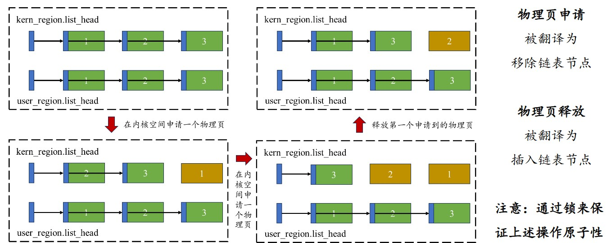
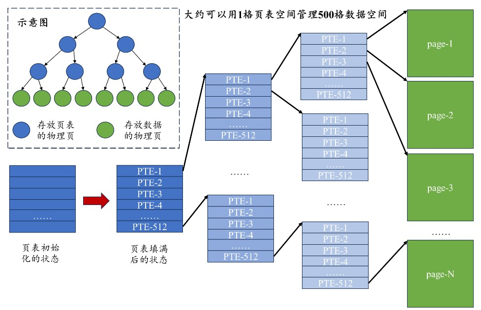

# LAB-2：内存管理

本实验在 RISC-V64 QEMU `virt` 平台上完成两项任务：

1. **物理页管理**：将可分配的物理内存切分为 4 KiB 页面，分别维护内核页和用户页的空闲链表，并提供并发安全的分配与释放接口。
2. **虚拟内存页表管理**：按照 Sv39 规范建立三级页表，实现映射、解映射和页表打印，为内核建立 MMIO 与 RAM 的直接映射并开启 MMU。

当前阶段只实现内核共享页表。用户进程页表、页表销毁、缺页处理和跨 hart TLB 刷新将在后续实验中完善。

## 1. 物理页管理

### 1.1 `kernel.ld`与内核布局

首先需要关注`kernel.ld`文件，它规定了内核可执行文件`kernel-qemu.elf`的入口地址，以及各个 section 被载入内存后的布局。其结构如下：

```ld
OUTPUT_ARCH("riscv")
ENTRY(_entry)

SECTIONS
{
  . = 0x80000000;

  .text : { ... }
  .rodata : { ... }
  .data : { ... }
  .bss : { ... }
}
```

这个链接脚本规定了以下内容：

- **起始地址**：将位置计数器设置为`0x80000000`。ELF 中各 section 的地址从这里开始；内核启动时尚未启用分页，因此加载地址也是实际访问的物理地址。
- **排列顺序**：`.text`、`.rodata`、`.data`和`.bss`依次排列。
- **对齐要求**：使用`. = ALIGN(16)`或`. = ALIGN(0x1000)`将数据或页面边界对齐。
- **导出符号**：使用`PROVIDE(KERNEL_DATA = .)`、`PROVIDE(ALLOC_BEGIN = .)`等语句，将链接时确定的边界地址提供给 C 和汇编代码。

链接器会把布局信息写入 ELF：

- **Program Headers（程序头表）**描述可加载 segment 的`p_vaddr`、`p_offset`、`p_filesz`和`p_memsz`等信息，供 QEMU 或 bootloader 装载内核。
- **Section Headers（节头表）**描述`.text`、`.data`等 section 的`sh_addr`、`sh_offset`和大小等细粒度信息。

构建后可使用以下命令检查实际布局：

```sh
riscv64-elf-readelf -l target/kernel/kernel-qemu.elf  # 查看 Program Headers 和各 segment 的加载布局
riscv64-elf-readelf -S target/kernel/kernel-qemu.elf  # 查看 Section Headers 和各 section 的地址、偏移及大小
riscv64-elf-nm -n target/kernel/kernel-qemu.elf       # 按地址排序查看符号，确认各边界符号的实际值
```

本项目在`.text`末尾按页对齐并导出`KERNEL_DATA`，以此标记只读可执行代码映射的末端：

```ld
.text : {
  *(.text .text.*)
  . = ALIGN(0x1000);
  /* 预留 trampoline 的位置 */
  PROVIDE(KERNEL_DATA = .);
}
```

在最后一个 section 后按页对齐并导出物理页分配边界：

```ld
. = ALIGN(4096);
PROVIDE(ALLOC_BEGIN = .);
PROVIDE(ALLOC_END = 0x80000000 + 128M);
```

`KERNEL_DATA`和`ALLOC_BEGIN`由链接结果决定，不应在 C 代码中写死为固定地址。

### 1.2 物理内存分页

#### 物理地址划分

QEMU `virt`物理地址空间不只有 RAM，还包含 MMIO：

| 物理地址范围 | 用途 |
| --- | --- |
| `0x02000000`起 | CLINT |
| `0x0c000000`起 | PLIC |
| `0x10000000`起 | UART |
| `[0x80000000, 0x88000000)` | 128 MiB RAM |

`kernel.ld`将 RAM 划分为三个部分：

- `[KERNEL_BASE, KERNEL_DATA)`存放`kernel-qemu.elf`的代码。
- `[KERNEL_DATA, ALLOC_BEGIN)`存放`kernel-qemu.elf`的只读数据、数据和 BSS。
- `[ALLOC_BEGIN, ALLOC_END)`是尚未使用、可以动态分配和回收的物理页。

对应的布局如下：

```text
0x80000000 = KERNEL_BASE
    .text
KERNEL_DATA                 # .text 结束，4 KiB 对齐
    .rodata / .data / .bss
ALLOC_BEGIN                 # 内核映像结束，4 KiB 对齐
    内核页池：KERN_PAGES * PGSIZE = 1024 * 4 KiB = 4 MiB
    用户页池：剩余可分配 RAM
0x88000000 = ALLOC_END
```

前两个区域会被内核持续占用，不参与动态分配和回收；物理页管理器只管理`[ALLOC_BEGIN, ALLOC_END)`。

#### 页面管理模式

本内核采用“**4 KiB 物理页切分 + 空闲链表组织**”的管理方式。`[ALLOC_BEGIN, ALLOC_END)`被完整切分成若干个 4 KiB 页面，不会产生不足一页的剩余空间。

为内核与用户程序预留不同的物理页配额，可分配区域以`KERN_PAGES`为边界划分为两个`alloc_region`：

- `kern_region`管理前 1024 页，供根页表、中间页表等内核对象使用。
- `user_region`管理其余页面，供后续用户程序的数据和代码使用。

每个`alloc_region`记录一组空闲物理页的起止地址、空闲页面数、链表头节点，以及保护链表和计数一致性的自旋锁：

```c
// 物理页节点
typedef struct page_node
{
    struct page_node *next;
} page_node_t;

// 许多物理页构成一个可分配的区域
typedef struct alloc_region
{
    uint64 begin;          // 起始物理地址
    uint64 end;            // 终止物理地址
    spinlock_t lk;         // 保护链表和空闲页面数
    uint32 allocable;      // 可分配页面数
    page_node_t list_head; // 空闲页链表的头节点
} alloc_region_t;
```

相比使用数组或位图查找空闲页，空闲链表可以直接在表头完成页面分配和回收。它不需要为每个物理页额外保留常驻的`page_node`：页面空闲时，其前 64 bits 被解释为`next`指针；页面分配出去后，这部分空间恢复为普通页面内容。

下图展示了两个区域的空闲链表，以及物理页申请和释放对链表的影响：申请页面时移除链表首节点；释放页面时将其插回链表头部。初始化时链表按物理地址递增，释放使用头插法，因此释放后的页面会按 LIFO 顺序再次分配。



这里的双区域只是物理页配额划分，不代表当前已经实现内核与用户地址空间的访问隔离。当前内核页表仍以 supervisor `R|W`权限恒等映射全部 RAM。

#### `pmem_init()`初始化

`pmem_init()`负责填写`kern_region`和`user_region`的边界、空闲页面数和链表内容。`PGSIZE`定义页面大小，`KERN_PAGES`定义可分配区域开头由内核页池持有的页面数。

空闲链表直接使用每个空闲页面的前 64 bits 存储`next`。初始化时以`PGSIZE`为步长遍历两个区域，使每个页面指向物理地址相邻的下一个页面，并将区域末页的`next`设为`NULL`：

```c
void pmem_init(void)
{
    spinlock_init(&kern_region.lk, "kern_region");
    kern_region.begin = (uint64)ALLOC_BEGIN;
    kern_region.end = (uint64)ALLOC_BEGIN + KERN_PAGES * PGSIZE;
    kern_region.allocable = KERN_PAGES;
    kern_region.list_head.next = (page_node_t *)kern_region.begin;
    for (uint64 pg = kern_region.begin; pg < kern_region.end; pg += PGSIZE)
    {
        page_node_t *node = (page_node_t *)pg;
        node->next = (pg + PGSIZE < kern_region.end)
                         ? (page_node_t *)(pg + PGSIZE)
                         : NULL;
    }

    spinlock_init(&user_region.lk, "user_region");
    user_region.begin = kern_region.end;
    user_region.end = (uint64)ALLOC_END;
    user_region.allocable = (user_region.end - user_region.begin) / PGSIZE;
    user_region.list_head.next = (page_node_t *)user_region.begin;
    for (uint64 pg = user_region.begin; pg < user_region.end; pg += PGSIZE)
    {
        page_node_t *node = (page_node_t *)pg;
        node->next = (pg + PGSIZE < user_region.end)
                         ? (page_node_t *)(pg + PGSIZE)
                         : NULL;
    }
}
```

### 1.3 分配与释放

物理页管理器提供三个核心操作：

```c
void pmem_init();                  // 初始化两个区域，只调用一次
void *pmem_alloc(bool in_kernel);  // 从指定区域申请一个物理页
void pmem_free(uint64 page);       // 释放之前申请的物理页
```

`pmem_init()`初始化两个区域的边界、计数、自旋锁和空闲链表。`pmem_alloc(true)`从内核链表取页，`pmem_alloc(false)`从用户链表取页；取出的页面会被清零，区域耗尽时触发 panic。`pmem_free(page)`根据地址判断页面所属区域，再将其插回对应链表。

两个池拥有独立自旋锁，所以同一池内的链表和计数更新是串行的，不同池可以并发操作。页面已经从空闲链表移除后才执行清零，因此清零过程不需要持锁。

物理页管理需要维持以下不变量：

- `begin`和`end`必须页对齐，区域采用左闭右开区间。
- `ALLOC_BEGIN + KERN_PAGES * PGSIZE <= ALLOC_END`。
- 链表中的页面数应等于`allocable`。
- 已分配页面不能再次分配，已释放页面不能重复释放。
- 传给`pmem_free`的地址应是分配器返回的页首地址。

重复释放目前仍依赖调用者避免，代码尚未维护位图或引用计数来记录页面的分配状态。

## 2. 虚拟内存页表管理

物理页分配器解决了“哪些物理页空闲、哪些物理页已经分配”的问题，但直接使用物理地址无法为不同程序提供各自独立、连续的地址空间。为此，内核需要用页表记录虚拟页到物理页的对应关系，再由 MMU 根据页表自动完成每次内存访问的地址翻译。

本实验采用 RISC-V 的 Sv39 虚拟内存规范，页表管理围绕两个概念展开：

- **页表项（PTE）**描述下一级页表或最终物理页的位置与访问权限。
- **页表（page table）**是由 512 个 PTE 构成的 4 KiB 物理页，多级页表共同组成一棵按需生长的树。

### 2.1 PTE 与三级页表

Sv39 使用三级页表，每级索引 9 bits，页内偏移 12 bits：

```text
VA = VPN[2] (9) | VPN[1] (9) | VPN[0] (9) | offset (12)
       root          middle        leaf          4 KiB page
```

每个 PTE 占 8 bytes，主要由物理页号 PPN 和低位标志组成。硬件先用`VPN[2]`索引顶级页表，从 PTE 中找到次级页表；再用`VPN[1]`找到低级页表；最后用`VPN[0]`找到指向实际代码或数据页的叶子 PTE。

根页表刚初始化时只是一个被清零的 4 KiB 页面。随着映射增加，系统按需申请新的中间页表页，页表树逐步伸展。下图中的蓝色节点是存放有效页表项的页表页，绿色节点是存放代码或数据的普通物理页：



顶级和次级 PTE 保存下一级页表的 PPN，低级叶子 PTE 保存最终物理页的 PPN。页内偏移不经过页表转换，直接成为最终物理地址的低 12 bits。

硬件 Sv39 具有低、高两个 canonical 地址区间；当前实现设置`VA_MAX = 1 << 38`，只使用低半区`[0, 256 GiB)`。本实验只使用 level-0 的 4 KiB 叶子项，不支持 level-1 的 2 MiB 页或 level-2 的 1 GiB 页。

### 2.2 PTE 的状态与权限

PTE 低位格式为：

```text
RSW | D A G U X W R V
```

| 条件 | 含义 |
| --- | --- |
| `V = 0` | 无效 PTE，其余位不参与地址翻译 |
| `V = 1`且`R/W/X = 0` | 非叶子 PTE，PPN 指向下一级页表 |
| `V = 1`且`R = 1`或`X = 1` | 合法叶子 PTE，PPN 指向物理页 |
| `V = 1`、`R = 0`且`W = 1` | RISC-V 保留的非法组合 |

常用转换：

```c
vpn = VA_TO_VPN(va, level);
pte = PA_TO_PTE(pa) | flags;
pa = PTE_TO_PA(pte);
flags = PTE_FLAGS(pte);
```

`PTE_CHECK(pte)`只检查`R/W/X`是否全零；必须先确认`PTE_V`，才能把结果解释为有效的非叶子项。RISC-V 将`W=1、R=0`保留为非法组合，实际映射应避免只设置`PTE_W`。

### 2.3 页表遍历、映射与解映射

页表操作的依赖顺序是`vm_getpte -> vm_mappages -> vm_unmappages`。

#### `vm_getpte`

从 level 2 开始，根据 VPN 逐级下降并返回 level-0 PTE 的地址：

- `alloc=false`：中间页表不存在时返回`NULL`。
- `alloc=true`：从内核页池分配清零页面，并写入`PA_TO_PTE(page) | PTE_V`。
- 遇到高层叶子项会触发断言，因为本实现不支持大页。
- `va >= VA_MAX`时 panic。

代码将 PTE 中的 PA 直接转换为可解引用指针。这在分页前依赖 Bare 模式，在分页后依赖内核对 RAM 的恒等映射。

#### `vm_mappages`

建立`[va, va + len)`到物理页的连续映射：

- `va`和`pa`必须页对齐，`len > 0`。
- `len`是字节数；末尾不足一页时仍映射完整页面。
- 范围不得超过`VA_MAX`，检查使用减法避免`va + len`溢出。
- 目标 PTE 已有效时触发重映射断言。
- 函数补充`PTE_V`，调用者提供`R/W/X/U`等权限。
- 函数本身不刷新 TLB，活动页表的调用者必须显式处理。

#### `vm_unmappages`

逐页清除`[va, va + len)`中的叶子 PTE：

- 区间中的每个页面都必须已经映射。
- `freeit=true`时同时将叶子物理页交还给物理分配器。
- 不会回收空的中间页表，也不会释放根页表。
- 不会刷新 TLB。

同一物理页存在多个映射时不能随意使用`freeit=true`，否则其他别名会指向已经释放并可能被复用的页面。

#### `vm_print`

递归打印有效的三级页表项，用于检查 VPN、PA 和 flags。它假定高两级只有非叶子项、level 0 只有叶子项。完整打印内核直接映射会产生大量输出，通常只应用于小型测试页表。

## 3. 内核页表

### 3.1 建立直接映射

`kvm_init()`先从内核池分配根页表，再建立 VA 等于 PA 的映射：

| 虚拟地址范围 | 物理地址范围 | 权限 | 用途 |
| --- | --- | --- | --- |
| `[UART_BASE, UART_BASE + 0x1000)` | 相同 | `R W` | UART 寄存器 |
| `[CLINT_BASE, CLINT_BASE + 0x10000)` | 相同 | `R W` | CLINT 寄存器 |
| `[PLIC_BASE, PLIC_BASE + 0x400000)` | 相同 | `R W` | PLIC 寄存器 |
| `[KERNEL_BASE, KERNEL_DATA)` | 相同 | `R X` | 内核 `.text` |
| `[KERNEL_DATA, ALLOC_BEGIN)` | 相同 | `R W` | `.rodata/.data/.bss` |
| `[ALLOC_BEGIN, ALLOC_END)` | 相同 | `R W` | 全部可分配 RAM |

当前映射全部使用 4 KiB 叶子页。页表开销为 1 个根页、MMIO 的 1 个 level-1 页与 4 个 level-0 页、RAM 的 1 个 level-1 页与 64 个 level-0 页，共 71 个内核页。因此`kvm_init()`后内核池剩余 953 页。

`.rodata`当前位于`KERNEL_DATA`之后，所以也被映射为可写；若后续需要更严格的 W^X/只读数据保护，应在链接脚本中额外导出边界并拆分映射。

所有内核映射都不设置`PTE_U`。代码也没有预置`PTE_A/PTE_D`，当前运行依赖 QEMU 在访问页面时更新这些位。

### 3.2 启用分页

每个 hart 都执行：

```c
w_satp(MAKE_SATP(kernel_pgtbl));
sfence_vma();
```

`MAKE_SATP`设置 MODE=Sv39、ASID=0，并填入根页表 PPN。`sfence.vma`刷新当前 hart 的全部 TLB 项。共享页表在启用前已由 hart 0 完成构建，因此启动阶段不需要 TLB shootdown。

运行期间若修改活动页表，调用者必须负责本地`sfence.vma`；多 hart 共享页表还需要实现跨 hart TLB shootdown。

## 4. 验证记录

当前`main()`只执行初始化和双 hart 启动 smoke test。功能测试曾通过临时替换`main()`执行；完整代码、实际输出、运行方式见[`TESTING.md`](TESTING.md)。

| 测试 | 核心检查 | 结果 |
| --- | --- | --- |
| 内核页并发分配 | 两个 hart 各申请、写入、释放 512 页 | 通过，无锁错误 |
| 用户页分配/释放 | 地址属于用户池；释放后重新分配并逐字节检查清零 | 通过，重新分配顺序符合 LIFO |
| 内核池耗尽 | 第 1025 次内核页申请 | 按预期 panic |
| 跨层级页表映射 | 覆盖不同 VPN[2:0]和不足一页的长度 | PTE 地址、PA 和 flags 符合预期 |
| 映射与解映射断言 | 两组独立 PA 的映射、权限、清除和释放 | 输出`test_mapping_and_unmapping passed!` |
| 重复映射 | 对有效 PTE 再次调用`vm_mappages` | 按预期触发 remapping 断言 |

## 5. 历史问题解决：自旋锁持有者标记

运行第一组测试用例时，在释放已分配的页面时出现了`panic: spinlock_acquire`错误。

GDB 调试信息如下。地址及`pmem_free(page, in_kernel)`签名来自问题发生时的旧版本：

```text
(gdb) b src/kernel/lock/spinlock.c:56
Breakpoint 1 at 0x80000818: file src/kernel/lock/spinlock.c, line 56.
(gdb) c
Continuing.

Thread 1 hit Breakpoint 1, spinlock_acquire (lk=lk@entry=0x80005398 <kern_region+16>) at src/kernel/lock/spinlock.c:56
56              panic("spinlock_acquire");
(gdb) p lk->name
$1 = 0x800011d8 "kern_region"
(gdb) bt
#0  spinlock_acquire (lk=lk@entry=0x80005398 <kern_region+16>) at src/kernel/lock/spinlock.c:56
#1  0x0000000080000bdc in pmem_free (page=2147532800, in_kernel=in_kernel@entry=true) at src/kernel/mem/pmem.c:81
#2  0x00000000800001dc in main () at src/kernel/main.c:32
```

研究后发现，问题出在 spinlock 实现中的竞争窗口。早期代码用`cpuid=0`表示无人持有锁，但 0 同时也是 CPU 0 的合法 hart ID。在并发执行时，`spinlock_acquire()`中的`spinlock_holding()`可能错误地判断 CPU 0 已持有锁并触发 panic。

出错时的具体操作序列：

```text
CPU1: 进入 spinlock_release(&lk);
CPU1: lk->cpuid = 0; // 清零 cpuid
CPU0: 进入 spinlock_acquire(&lk);
CPU0: 进入 spinlock_holding(&lk);
CPU0: r = (lk->locked && lk->cpuid == mycpuid());
// 此时 lk->locked == 1，lk->cpuid == 0，函数认为锁被 CPU0 持有，触发 panic
// 但实际上锁被 CPU1 持有（正在释放），出现了误判
```

该序列发生在 CPU 1 已清除`cpuid`、但尚未通过`__sync_lock_release`清除`locked`的窗口内。此时 CPU 0 看到`locked == 1 && cpuid == 0`，因而把 CPU 1 正在释放的锁误认为由自己持有。

要解决这个问题，需要避免“无人持有”和“CPU 0 持有”使用相同的`cpuid`。当前修复使用特殊值`-1`表示无人持有：`spinlock_init()`初始化时将`lk->cpuid`设为`-1`，`spinlock_release()`释放时也写入`-1`。这样`spinlock_holding()`不会再把释放窗口误判为 CPU 0 已持锁。并发申请、释放全部内核页的测试验证了该修复。

## 6. 速查

### 6.1 核心常量

| 常量 | 含义 |
| --- | --- |
| `KERNEL_BASE` | RAM 和内核加载基址，`0x80000000` |
| `ALLOC_END` | 内核使用的 RAM 末端，`0x88000000` |
| `PGSIZE` | 4 KiB |
| `KERN_PAGES` | 内核池 1024 页，即 4 MiB |
| `VA_MAX` | 当前实现允许的 VA 上界，`1 << 38` |
| `SATP_SV39` | `satp.MODE = 8` |
